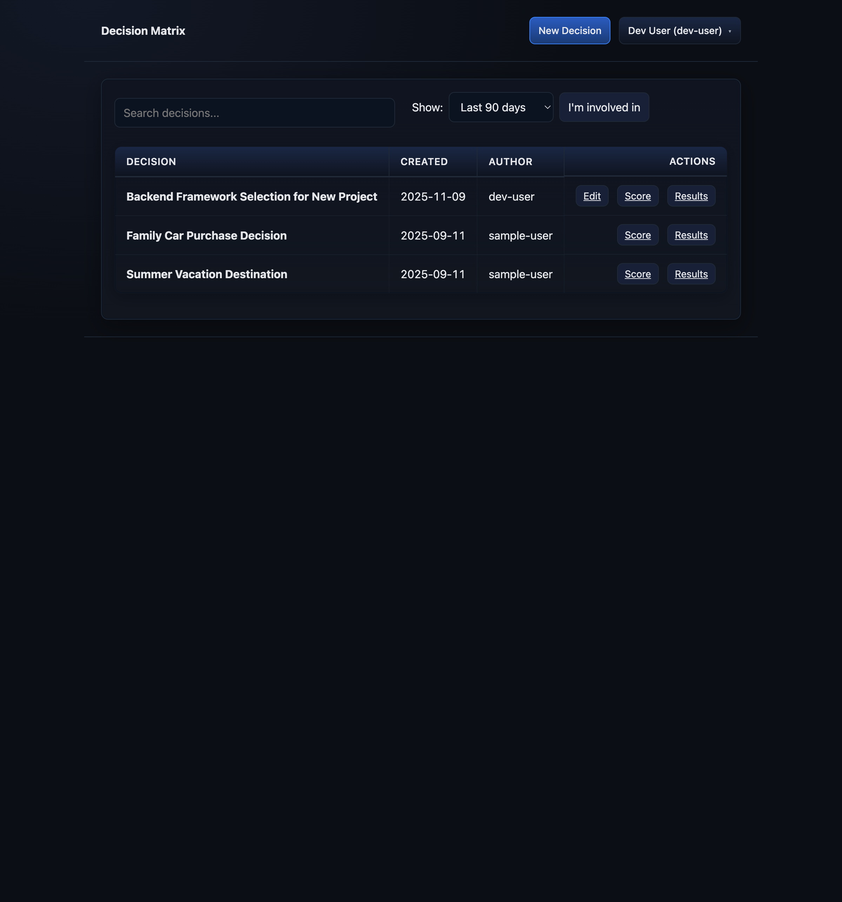
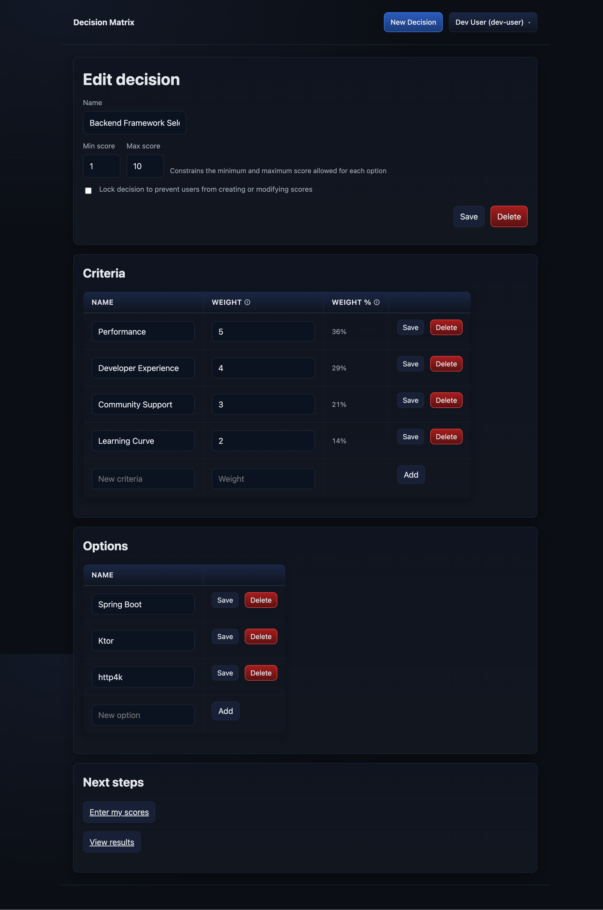
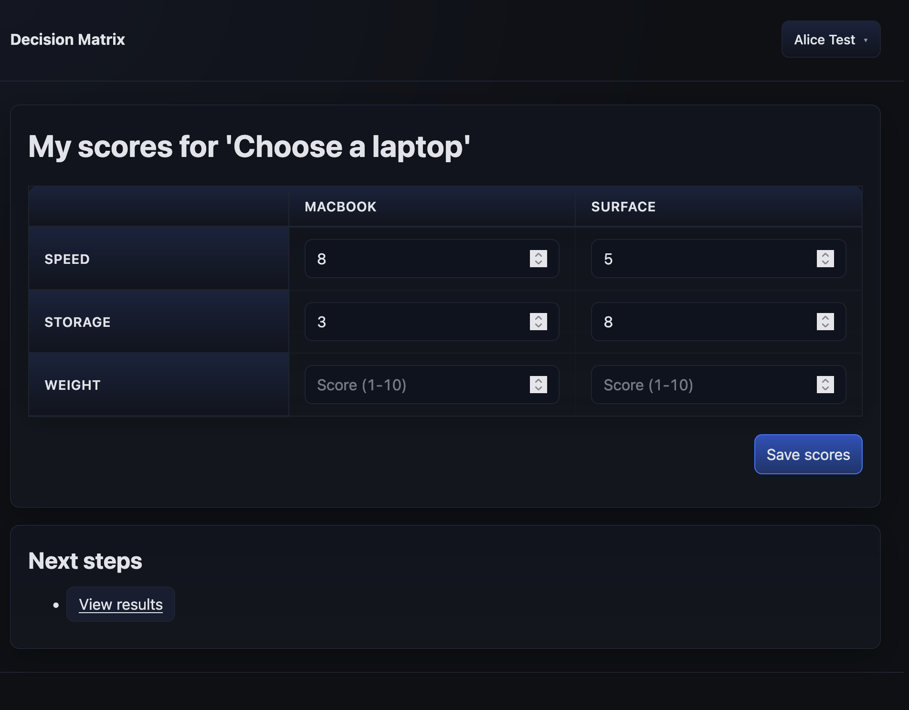
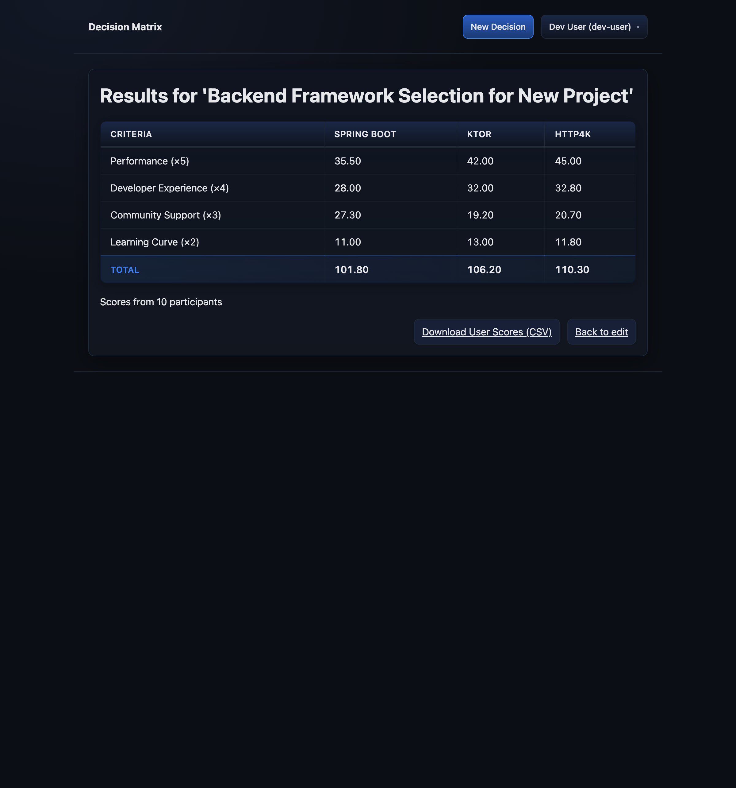

# decision-matrix
Weighted decision matrix that supports multiple users. 
When calculating each option's weighted score, it uses the average of each user's score.
It stores the data in a sqlite database, by default located in $HOME/decision_matrix.sqlite. 

# This tool in early development mode!
I'm just building the 1.0 version now, so it's not ready for production use yet.

## Screenshots
### Index

### Edit

### Score

### Results

## Development
See [DEVELOPMENT.md](DEVELOPMENT.md) for development prerequisites.  
See [CLAUDE.md](CLAUDE.md) for development guidelines, including how to configure authentication for development.
