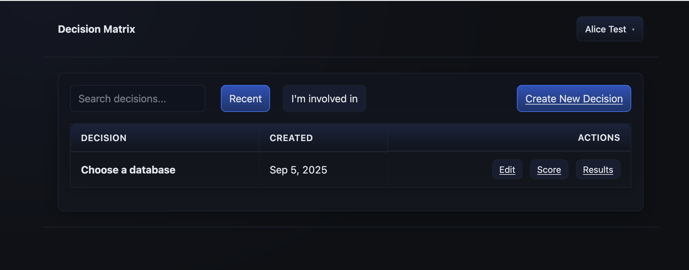
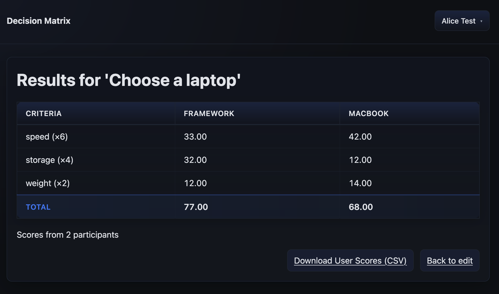

# Decision Matrix

Weighted decision matrix that supports multiple users. When calculating each option's weighted score, it uses the average of each user's score.

## Quick Start with Docker

The easiest way to run Decision Matrix is using Docker with the pre-built images from GitHub Container Registry.

### Using Docker Run
For a quick test with development mode:
1. Start PostgreSQL
```bash
docker run -d --name postgres \
  -e POSTGRES_DB=decision_matrix \
  -e POSTGRES_USER=decision_matrix \
  -e POSTGRES_PASSWORD=decision_matrix_password \
  -p 5432:5432 \
  postgres:16
```
2. Start Decision Matrix
```bash
# Start Decision Matrix
docker run -p 8080:8080 \
  -e DM_DEV_MODE=true \
  -e DB_HOST=host.docker.internal \
  -e DB_USER=decision_matrix \
  -e DB_PASSWORD=decision_matrix_password \
  -e DB_NAME=decision_matrix \
  ghcr.io/weighty-decision/decision-matrix:latest
```
3. Access the application at http://localhost:8080

### Using Docker Compose 

1. Create a `docker-compose.yml` file:
   ```yaml
   services:
     postgres:
       image: postgres:16
       environment:
         POSTGRES_DB: decision_matrix
         POSTGRES_USER: decision_matrix
         POSTGRES_PASSWORD: your_secure_password_here
       ports:
         - "5432:5432"
       volumes:
         - postgres_data:/var/lib/postgresql/data
       healthcheck:
         test: ["CMD-SHELL", "pg_isready -U decision_matrix -d decision_matrix"]
         interval: 10s
         timeout: 5s
         retries: 5

     decision-matrix:
       image: ghcr.io/weighty-decision/decision-matrix:latest # use a specific version in production for version stability
       ports:
         - "8080:8080"
       environment:
         # You can set the DM_HTTP_SERVER_PORT environment variable to change the HTTP server port
   
         # Database configuration
         - DB_HOST=postgres
         - DB_PORT=5432
         - DB_USER=decision_matrix
         - DB_PASSWORD=your_secure_password_here
         - DB_NAME=decision_matrix
         # Additional connection parameters if needed
         #- DB_CONNECTION_PARAMS="sslmode=require"

         # Authentication (choose one of the options below)

         # Option 1: Development mode (no authentication required)
         - DM_DEV_MODE=true

         # Option 2: Production OAuth (uncomment and configure)
         # - DM_DEV_MODE=false
         # - DM_OAUTH_ISSUER_URL=https://your-oauth-provider.com
         # - DM_OAUTH_CLIENT_ID=your-client-id
         # - DM_OAUTH_CLIENT_SECRET=your-client-secret
         # - DM_OAUTH_REDIRECT_URI=http://localhost:8080/auth/callback

         # Option 3: Mock OAuth for testing (uncomment to use)
         # - DM_DEV_MODE=false
         # - DM_MOCK_OAUTH_SERVER=true
         # - DM_OAUTH_ISSUER_URL=http://localhost:8081
         # - DM_OAUTH_CLIENT_ID=test-client
         # - DM_OAUTH_CLIENT_SECRET=test-secret
         # - DM_OAUTH_REDIRECT_URI=http://localhost:8080/auth/callback
       depends_on:
         postgres:
           condition: service_healthy

   volumes:
     postgres_data:
   ```

2. Start the application:
   ```bash
   docker-compose up -d
   ```

3. Access the application at http://localhost:8080

## Configuration

### Authentication Options

#### Development Mode (No Authentication)
For testing and development:
```bash
DM_DEV_MODE=true
DM_DEV_USER_ID=your-username  # Optional, defaults to "dev-user"
```

#### Production OAuth
For production deployment with any OAuth 2.0/OpenID Connect provider:
```bash
DM_DEV_MODE=false
DM_OAUTH_ISSUER_URL=https://your-oauth-provider.com
DM_OAUTH_CLIENT_ID=your-client-id
DM_OAUTH_CLIENT_SECRET=your-client-secret
DM_OAUTH_REDIRECT_URI=https://your-domain.com/auth/callback
DM_OAUTH_SCOPES=openid,profile,email  # Optional, this is the default
```

Optional claim mapping (for providers using non-standard claim names):
```bash
# Map ID Token claim names to the fields the app needs
# If unset, defaults are used as shown
DM_OAUTH_EMAIL_CLAIM=mail               # default: "email" (required)
DM_OAUTH_ID_CLAIM=samaccountname        # default: "sub"
DM_OAUTH_NAME_CLAIM=displayName         # optional
DM_OAUTH_FIRST_NAME_CLAIM=given_name    # optional
DM_OAUTH_LAST_NAME_CLAIM=family_name    # optional
```

Claim resolution order:
- id: DM_OAUTH_ID_CLAIM → sub (required)
- email: DM_OAUTH_EMAIL_CLAIM → email (required)
- name: DM_OAUTH_NAME_CLAIM → first+last from DM_OAUTH_FIRST_NAME_CLAIM/DM_OAUTH_LAST_NAME_CLAIM → name → preferred_username (optional)

If a required claim (id or email) cannot be resolved after applying mappings and defaults, login will fail with a clear error message.

#### Mock OAuth (Testing)
For testing OAuth flows without external dependencies:
```bash
DM_DEV_MODE=false
DM_MOCK_OAUTH_SERVER=true
DM_OAUTH_ISSUER_URL=http://localhost:8081
DM_OAUTH_CLIENT_ID=test-client
DM_OAUTH_CLIENT_SECRET=test-secret
DM_OAUTH_REDIRECT_URI=http://localhost:8080/auth/callback
```

Test users available: Alice Test (user1), Bob Test (user2), Admin User (admin)

### Database Configuration

```bash
DB_HOST=localhost                    # PostgreSQL host
DB_PORT=5432                        # PostgreSQL port (default: 5432)
DB_NAME=decision_matrix             # Database name
DB_USER=decision_matrix             # Database username
DB_PASSWORD=decision_matrix_password           # Database password
DB_CONNECTION_PARAMS=""             # Additional connection parameters
```

Common connection parameters:
- `sslmode=require` - Force SSL connection
- `sslmode=disable` - Disable SSL
- `connectTimeout=10` - Connection timeout in seconds
- `socketTimeout=30` - Socket timeout in seconds

### Server Configuration

```bash
DM_HTTP_SERVER_PORT=8080            # HTTP server port (default: 8080)
```

## Screenshots
### Home

### /decisions/{id}/edit/

### /decisions/{id}/my-scores

### /decisions/{id}/results


## Development

For developers who want to build and run the application from source:

### Prerequisites
- Java 21 or higher
- PostgreSQL database

### Running with Gradle
```bash
# start the database
docker-compose up -d
# run the application
./gradlew run
```

### Running Tests
```bash
./gradlew test
```

See [CLAUDE.md](CLAUDE.md) for more development guidelines, coding standards, and development environment setup.
