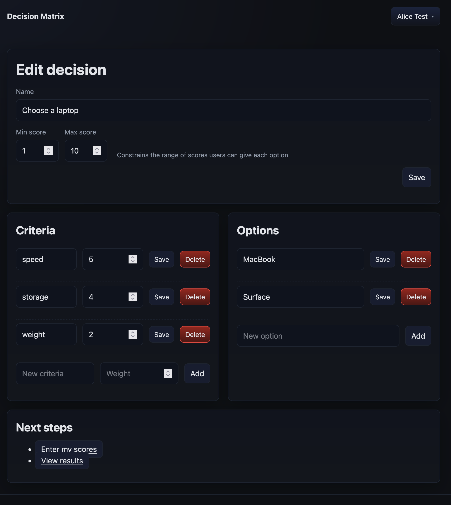

# Decision Matrix

Weighted decision matrix that supports multiple users. When calculating each option's weighted score, it uses the average of each user's score.

## How Scoring Works

The scoring system is designed to not penalize users for honest gaps in knowledge:

1. **User Scores**: Multiple users can score each option against each criterion
2. **Averaging**: For each option-criterion combination, all user scores are averaged
3. **Weighting**: The average is multiplied by the criterion's weight
4. **Omitted Scores**: If users don't provide a score for a particular criterion, it's treated as "not applicable" or "can't evaluate" rather than zero
5. **Normalization**: The final score is normalized so that omitted scores don't penalize the option

**Example**: If you have criteria with weights [5, 3, 4] (total = 12) and a user scores an option as [Performance=10, Cost=omitted, Usability=10]:
- Weighted sum: 5×10 + 4×10 = 90
- Total weight scored: 5 + 4 = 9
- Normalized score: (90 / 9) × 12 = 120

This means an option scored 10/10 on all evaluated criteria gets a perfect score of 120, regardless of whether some criteria were omitted.

## Quick Start with Docker Compose

```shell
docker-compose -f docker-compose.demo.yml up
```

Then access the application at http://localhost:8080

## Configuration

### Sample Data
You can load sample data by setting a `DM_INCLUDE_SAMPLE_DATA` environment variable to `true`.
The sample data will only be loaded if the database is empty.

### Authentication Options

#### Development Mode (No Authentication)
For testing and development:
```bash
DM_DEV_MODE=true
DM_DEV_USER_ID=your-username  # Optional, defaults to "dev-user"
```

#### Production OAuth
For production deployment with any OAuth 2.0/OpenID Connect provider:
```bash
DM_DEV_MODE=false
DM_OAUTH_ISSUER_URL=https://your-oauth-provider.com
DM_OAUTH_CLIENT_ID=your-client-id
DM_OAUTH_CLIENT_SECRET=your-client-secret
DM_OAUTH_REDIRECT_URI=https://your-domain.com/auth/callback
DM_OAUTH_SCOPES=openid,profile,email  # Optional, this is the default
```

Optional claim mapping (for providers using non-standard claim names):
```bash
# Map ID Token claim names to the fields the app needs
# If unset, defaults are used as shown
DM_OAUTH_EMAIL_CLAIM=mail               # default: "email" (required)
DM_OAUTH_ID_CLAIM=samaccountname        # default: "sub"
DM_OAUTH_NAME_CLAIM=displayName         # optional
DM_OAUTH_FIRST_NAME_CLAIM=given_name    # optional
DM_OAUTH_LAST_NAME_CLAIM=family_name    # optional
```

Claim resolution order:
- id: DM_OAUTH_ID_CLAIM → sub (required)
- email: DM_OAUTH_EMAIL_CLAIM → email (required)
- name: DM_OAUTH_NAME_CLAIM → first+last from DM_OAUTH_FIRST_NAME_CLAIM/DM_OAUTH_LAST_NAME_CLAIM → name → preferred_username (optional)

If a required claim (id or email) cannot be resolved after applying mappings and defaults, login will fail with a clear error message.

#### Mock OAuth (Testing)
For testing OAuth flows without external dependencies:
```bash
DM_DEV_MODE=false
DM_MOCK_OAUTH_SERVER=true
DM_OAUTH_ISSUER_URL=http://localhost:8081
DM_OAUTH_CLIENT_ID=test-client
DM_OAUTH_CLIENT_SECRET=test-secret
DM_OAUTH_REDIRECT_URI=http://localhost:8080/auth/callback
```

Test users available: Alice Test (user1), Bob Test (user2), Admin User (admin)

### Database Configuration

```bash
DB_HOST=localhost                     # PostgreSQL host
DB_PORT=5432                          # PostgreSQL port (default: 5432)
DB_NAME=decision_matrix               # Database name
DB_USER=decision_matrix               # Database username
DB_PASSWORD=decision_matrix_password  # Database password
DB_CONNECTION_PARAMS=""               # Additional connection parameters
```

Common connection parameters:
- `sslmode=require` - Force SSL connection
- `sslmode=disable` - Disable SSL
- `connectTimeout=10` - Connection timeout in seconds
- `socketTimeout=30` - Socket timeout in seconds

### Server Configuration

```bash
DM_HTTP_SERVER_PORT=8080            # HTTP server port (default: 8080)
```

## Screenshots
### Home

### /decisions/{id}/edit/

### /decisions/{id}/my-scores

### /decisions/{id}/results


## Development

For developers who want to build and run the application from source:

### Prerequisites
- Java 21 or higher
- A Docker-compatible tool (Docker, Podman, Colima, etc.)

### Running with Gradle
```bash
# The docker-compose.yml contains a postgres database
docker-compose up -d
# run the application
./gradlew run
```

### Running Tests
```bash
./gradlew check
```

See [AGENTS.md](AGENTS.md) for more development guidelines, coding standards, and development environment setup.
